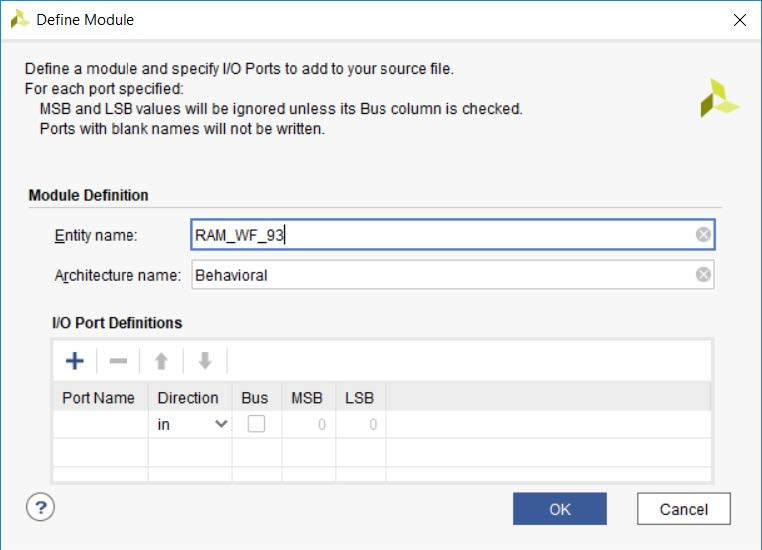

# Inicialización de memorias desde ficheros de texto en FPGA
# Tutorial para VHDL93 en Vivado y depuración de su contenido

Nicolás Ruiz Requejo (Autor)


Aqui va la tabla de Contenido 

## Objetivos

El presente tutorial tiene los siguientes objetivos:

-   Formas de inicializar el contenido de memorias RAM implementadas en
    FPGA a partir de ficheros de texto. De modo que cada línea de texto
    representa el dato a almacenar en cada dirección de memoria, binario
    o hexadecimal.

-   Uso de un "IP core" de depuración, VIO, para examinar el contenido
    de la memoria RAM implementada en tiempo de ejecución.

## Sobre la biblioteca VHDL para la gestión de ficheros 

Los mecanismos presentes incluyen:

-   Definiciones de tipos de fichero

-   Declaración de objetos fichero.

-   Procedimientos para lectura y escritura en ficheros. Estos ficheros
    solo pueden incluir datos escalares o compuestos de una sola
    dimensión.

Los constructores mencionados escriben y leen datos en formato binario
dependiendo de la herramienta utilizada. Por ejemplo, Vivado&reg; de Xilinx
puede escribir y leer enteros de un fichero con VHDL en un formato
distinto del que usa Quartus&reg; de Intel. Por ello para lograr la
interoperabilidad entre diferentes herramientas se usarán solo ficheros
de texto plano. E incluirán solo los tipos y operaciones que
proporcionan los paquetes "textio", de la biblioteca "std" y
"std\_logic\_textio" de la biblioteca "IEEE".

En general, las operaciones de lectura/escritura de ficheros en VHDL no
son sintetizables, pero sí permitidas en simulación, si bien algunas
herramientas permiten la lectura de ficheros para síntesis. A lo largo
de este tutorial se muestran las formas de realizarlo en Vivado&reg; con
proyectos en VHDL93 y VHDL2008.

## Inicialización de RAM en VHDL93 

Comenzamos creando un nuevo proyecto en Vivado&reg; *File \> Project \> New
\> next*

Lo llamaremos "RAM\_TEST\_93", hacemos click en el botón "Next" y
dejamos la opción "RTL project" establecida por defecto. A continuación,
creamos un nuevo fichero fuente VHDL de nombre "RAM\_WF\_93". Luego,
seleccionamos el modelo de FPGA, para este tutorial se ha usado la
Artix-7 xc7a100tcsg324-1; finalizamos.

Nos pedirá introducir las definiciones de puertos, lo ignoramos.


[Figura 1][fig1]


Cuando creamos un fichero VHDL, por defecto Vivado&reg; lo crea para
sintetizarlo según el estándar VHDL93. Podemos comprobarlos mirando las
propiedades del fichero, ver figura 2.


[Figura 2. Versión de VHDL][fig2]

Para este tutorial, utilizaremos la descripción de una memoria RAM de
tipo *write-first*. Copie el siguiente código:

```VHDL
library IEEE;
use IEEE.STD_LOGIC_1164.ALL;
use IEEE.NUMERIC_STD.ALL;

entity RAM_WF_93 is
    generic (
           address_width : integer := 4; 
           data_width : integer := 8);
    Port ( DataIn : in  std_logic_vector(data_width-1 downto 0);
           WE : in  std_logic;
           Address : in  std_logic_vector(address_width-1 downto 0);
           DataOut : out  std_logic_vector(data_width-1 downto 0);
           CLK : in  std_logic);
end RAM_WF_93;

architecture Behavioral of RAM_WF_93 is
    type ram_type is array(0 to (2**address_width)-1) 
            of std_logic_vector(data_width-1 downto 0);             
    
    signal RAM : ram_type;
begin

    process(Clk)
    begin
        if rising_edge(Clk) then
            if WE = '1' then
                RAM(to_integer(unsigned(Address))) <= DataIn;
                DataOut <= DataIn;
            else
                DataOut <= RAM(to_integer(unsigned(Address)));
            end if;
        end if;
    end process;
end Behavioral;
```
[Figura 3. Código VHDL RAM write-first genérica]()

El fichero de texto que vamos a usar para inicializar la RAM, tendrá
tantas líneas de texto como direcciones tenga la RAM inferida y cada
línea incluirá:

-   Una cadena de ceros y unos, tantos como bits tenga cada palabra de
    la RAM.

-   O una cadena en hexadecimal que coincida con el ancho de palabra de
    la RAM.

El fichero o está en binario o en hexadecimal, pero no podemos mezclar
ambos. Para nuestro ejemplo usaremos el siguiente contenido hexadecimal,
considerando una RAM de 16x8:

{width="1.225in" height="3.7600699912510938in"}

[]{#_Toc13855111 .anchor}Figura 4. Datos para inicializar la RAM

Código para leer el fichero {#código-para-leer-el-fichero .Helvetica-titulo-2}
---------------------------

Para usar los tipos y operaciones para trabajar con ficheros de texto,
incluimos los paquetes:

\-- Provides the types \"string\", \"text\" and \"line\"

**use** STD**.**TEXTIO**.ALL;**

\-\-- Allows \"std\_logic\" can be used as a type in the text file

**use** IEEE**.**STD\_LOGIC\_TEXTIO**.ALL;**

Vamos a añadir, en la cláusula **generic** de la entidad, un parámetro
de tipo *string* que sirva para pasar la ruta donde se encuentra el
fichero que queremos usar para inicializar la RAM:

+---------------------------------------------------------------------+
| **entity** RAM\_WF\_93 **is**                                       |
|                                                                     |
| **generic** **(** datafile **:** string **:=** \"D:\\mem.dat\"**;** |
|                                                                     |
| ...                                                                 |
+---------------------------------------------------------------------+

La forma de conseguir leer del fichero, es incluir una función en el
cuerpo de la arquitectura que reciba como parámetro la ruta del fichero
y devuelva una variable, del tipo *ram\_type* declarado en la
arquitectura. Esta función será llamada para inicializar la señal que
almacenará el contenido de la RAM.

El código de la función es:

+----------------------------------------------------------------------+
| \-\-\-\                                                              |
| -\-\-\-\-\-\-\-\-\-\-\-\-\-\-\-\-\-\-\-\-\-\-\-\-\-\-\-\-\-\-\-\-\-\ |
| -\-\-\-\-\-\-\-\-\-\-\-\-\-\-\-\-\-\-\-\-\-\-\-\-\-\-\-\-\-\-\-\-\-- |
|                                                                      |
| \-- \"Impure\" function means different types can be returned.       |
|                                                                      |
| \-- \"file\_name\" is a parameter to call the function               |
| \"load\_ram\_from\_file\".                                           |
|                                                                      |
| \-- The function returns the type \"ram\_type\" defined in this code |
|                                                                      |
| \-\-\-\-\                                                            |
| -\-\-\-\-\-\-\-\-\-\-\-\-\-\-\-\-\-\-\-\-\-\-\-\-\-\-\-\-\-\-\-\-\-\ |
| -\-\-\-\-\-\-\-\-\-\-\-\-\-\-\-\-\-\-\-\-\-\-\-\-\-\-\-\-\-\-\-\-\-- |
|                                                                      |
| **impure** **function** load\_ram\_from\_file**(**file\_name **:**   |
| **in** string**)** **return** ram\_type **is**                       |
|                                                                      |
| \-- \"fdata\" is the object type \"file\"                            |
|                                                                      |
| **file** fdata **:** text **open** read\_mode **is** file\_name**;** |
|                                                                      |
| \-- \"mline\" is a variable to read the file, line to line           |
|                                                                      |
| **variable** mline **:** line**;**                                   |
|                                                                      |
| \-- \"temp\_mem\" variable to store, within the function, each line  |
| is read                                                              |
|                                                                      |
| **variable** temp\_mem**:** ram\_type**;**                           |
|                                                                      |
| **begin**                                                            |
|                                                                      |
| \-- Body of the function is a loop to read the whole text file       |
|                                                                      |
| **for** i **in** ram\_type\'**range** **loop**                       |
|                                                                      |
| \-- \"readline\" is a function from \"TEXTIO\" package. Read a line  |
|                                                                      |
| \-- in file text in each iteration                                   |
|                                                                      |
| **readline(**fdata**,** mline**);**                                  |
|                                                                      |
| \-- To read binary format i.e: 4 bit length -\> 0011                 |
|                                                                      |
| \-- read(mline, temp\_mem**(**i**));**                               |
|                                                                      |
| \-- To read hex format i.e: 8 bit lenght -\> 2f                      |
|                                                                      |
| \-- Store the text in the variable to return                         |
|                                                                      |
| hread**(**mline**,** temp\_mem**(**i**));**                          |
|                                                                      |
| **end** **loop;**                                                    |
|                                                                      |
| **return** temp\_mem**;**                                            |
|                                                                      |
| **end** **function;**                                                |
+----------------------------------------------------------------------+

[]{#_Toc13855112 .anchor}Figura 5. Función para leer datos en el fichero
de texto

Necesitamos declarar la función como ***impure*** porque lo que devuelve
la función puede ser diferente para un mismo parámetro de entrada,
dependiendo del contenido del fichero en cada instante.

En la función se declara:

-   Un objeto ***file*** para acceder al fichero en modo solo lectura
    (***read\_mode***); el tipo del fichero para texto es ***text y***
    lo proporciona el paquete ***textio***.

-   Una variable de tipo ***line***, tipo proporcionado por el paquete
    ***textio*** que representa una línea completa de texto de un
    fichero.

-   Una variable de tipo ***ram\_type*** que es el tipo que hemos
    definido para representar el contenido de la RAM (vector de
    std\_logic\_vector).

Luego en un bucle que itera el número de líneas que tiene el fichero
(número de direcciones de la RAM):

-   se toma una línea de texto del fichero con la función
    ***readLine***.

-   Para extraer de la línea el valor en el tipo deseado que en nuestro
    caso es ***std\_logic\_vector*** usamos la función ***read(inout**
    line, **out** buffer**)*** si el formato es binario ó
    ***hread(inout** line, **out** buffer**)*** si está en hexadecimal.
    Ambas funciones se encuentran en el paquete
    ***ieee.std\_logic\_textio.***

-   En la posición i-ésima de la variable de tipo *ram\_type* se
    almacena el valor convertido a ***std\_logic\_vector*** de la línea
    i-ésima.

-   La función devuelve la variable de tipo *ram\_type* con el contenido
    para inicializar la memoria.

En el siguiente listado se muestra el código completo del ejemplo:

+----------------------------------------------------------------------+
| **library** IEEE**;**                                                |
|                                                                      |
| **use** IEEE**.**STD\_LOGIC\_1164**.ALL;**                           |
|                                                                      |
| \-- Provides the types \"string\", \"text\" and \"line\"             |
|                                                                      |
| **use** STD**.**TEXTIO**.ALL;**                                      |
|                                                                      |
| \-- Allows \"std\_logic\" can be used as a type in the text file     |
|                                                                      |
| \-- It is a not standard package and is deprecated.                  |
|                                                                      |
| **use** IEEE**.**STD\_LOGIC\_TEXTIO**.ALL;**                         |
|                                                                      |
| **use** IEEE**.**NUMERIC\_STD**.ALL;**                               |
|                                                                      |
| **entity** RAM\_WF\_93 **is**                                        |
|                                                                      |
| **generic** **(**datafile **:** string **:=**                        |
| \"F:\\VIVADO\_PROJECTS\_PRUEBAS\\MEMO\_INIT\\data\_init.dat\"**;**   |
|                                                                      |
| address\_width **:** integer **:=** 4**;**                           |
|                                                                      |
| data\_width **:** integer **:=** 8**);**                             |
|                                                                      |
| **Port** **(** DataIn **:** **in**                                   |
| std\_logic\_vector**(**data\_width**-**1 **downto** 0**);**          |
|                                                                      |
| WE **:** **in** std\_logic**;**                                      |
|                                                                      |
| Address **:** **in** std\_logic\_vector**(**address\_width**-**1     |
| **downto** 0**);**                                                   |
|                                                                      |
| DataOut **:** **out** std\_logic\_vector**(**data\_width**-**1       |
| **downto** 0**);**                                                   |
|                                                                      |
| CLK **:** **in** std\_logic**);**                                    |
|                                                                      |
| **end** RAM\_WF\_93**;**                                             |
|                                                                      |
| **architecture** Behavioral **of** RAM\_WF\_93 **is**                |
|                                                                      |
| **type** ram\_type **is** **array(**0 **to**                         |
| **(**2**\*\***address\_width**)-**1**)**                             |
|                                                                      |
| **of** std\_logic\_vector**(**data\_width**-**1 **downto** 0**);**   |
|                                                                      |
| \-\-\-\                                                              |
| -\-\-\-\-\-\-\-\-\-\-\-\-\-\-\-\-\-\-\-\-\-\-\-\-\-\-\-\-\-\-\-\-\-\ |
| -\-\-\-\-\-\-\-\-\-\-\-\-\-\-\-\-\-\-\-\-\-\-\-\-\-\-\-\-\-\-\-\-\-- |
|                                                                      |
| \-- FUNCTION to read a text file                                     |
|                                                                      |
| \-\-\-\                                                              |
| -\-\-\-\-\-\-\-\-\-\-\-\-\-\-\-\-\-\-\-\-\-\-\-\-\-\-\-\-\-\-\-\-\-\ |
| -\-\-\-\-\-\-\-\-\-\-\-\-\-\-\-\-\-\-\-\-\-\-\-\-\-\-\-\-\-\-\-\-\-- |
|                                                                      |
| \-- \"Impure\" function means different types can be returned.       |
|                                                                      |
| \-- \"file\_name\" is a parameter to call the function               |
| \"load\_ram\_from\_file\".                                           |
|                                                                      |
| \-- The function returns the type \"ram\_type\" defined in this code |
|                                                                      |
| \-\-\-\-\                                                            |
| -\-\-\-\-\-\-\-\-\-\-\-\-\-\-\-\-\-\-\-\-\-\-\-\-\-\-\-\-\-\-\-\-\-\ |
| -\-\-\-\-\-\-\-\-\-\-\-\-\-\-\-\-\-\-\-\-\-\-\-\-\-\-\-\-\-\-\-\-\-- |
|                                                                      |
| **impure** **function** load\_ram\_from\_file**(**file\_name **:**   |
| **in** string**)** **return** ram\_type **is**                       |
|                                                                      |
| \-- \"fdata\" is the object type \"file\"                            |
|                                                                      |
| **file** fdata **:** text **open** read\_mode **is** file\_name**;** |
|                                                                      |
| \-- \"mline\" is a variable to read the file, line to line           |
|                                                                      |
| **variable** mline **:** line**;**                                   |
|                                                                      |
| \-- \"temp\_mem\" is a variable to read values in a line             |
|                                                                      |
| **variable** temp\_mem**:** ram\_type**;**                           |
|                                                                      |
| **begin**                                                            |
|                                                                      |
| \-- Body of the function is a loop to read the whole text file       |
|                                                                      |
| **for** i **in** ram\_type\'**range** **loop**                       |
|                                                                      |
| \-- (1) READ A LINE from a file text                                 |
|                                                                      |
| \-- \"readline\" is a procedure from \"TEXTIO\" package.             |
|                                                                      |
| **readline(**fdata**,** mline**);**                                  |
|                                                                      |
| \-- (2) READ VALUES iN A LINE                                        |
|                                                                      |
| \-- \"Read\" is a procedure from \"TEXTIO\" package.                 |
|                                                                      |
| \-- Thanks to the non-standard package IEEE.STD\_LOGIC\_TEXTIO       |
| (deprecated)                                                         |
|                                                                      |
| \-- the data read can be as std\_logic type                          |
|                                                                      |
| \-- OPTION 2.1: Binary format                                        |
|                                                                      |
| \-- read(mline, temp\_mem(i));                                       |
|                                                                      |
| \-- OPTION 2.2: Hexadecimal format                                   |
|                                                                      |
| hread**(**mline**,** temp\_mem**(**i**));**                          |
|                                                                      |
| **end** **loop;**                                                    |
|                                                                      |
| **return** temp\_mem**;**                                            |
|                                                                      |
| **end** **function;**                                                |
|                                                                      |
| **signal** RAM **:** ram\_type **:=**                                |
| load\_ram\_from\_file**(**datafile**);**                             |
|                                                                      |
| **begin**                                                            |
|                                                                      |
| **process(**Clk**)**                                                 |
|                                                                      |
| **begin**                                                            |
|                                                                      |
| **if** **rising\_edge(**Clk**)** **then**                            |
|                                                                      |
| **if** WE **=** \'1\' **then**                                       |
|                                                                      |
| RAM**(to\_integer(**unsigned**(**Address**)))** **\<=** DataIn**;**  |
|                                                                      |
| DataOut **\<=** DataIn**;**                                          |
|                                                                      |
| **else**                                                             |
|                                                                      |
| DataOut **\<=** RAM**(to\_integer(**unsigned**(**Address**)));**     |
|                                                                      |
| **end** **if;**                                                      |
|                                                                      |
| **end** **if;**                                                      |
|                                                                      |
| **end** **process;**                                                 |
|                                                                      |
| **end** Behavioral**;**                                              |
+======================================================================+
|                                                                      |
+----------------------------------------------------------------------+

[]{#_Ref11096583 .anchor}Figura 6. Código completo de VHDL93.

En la línea destacada, es donde se declara la señal de la memoria RAM y
se inicializa llamando a la función "load\_ram\_from\_file".

Simulación {#simulación .Helvetica-titulo-2}
----------

Vamos a simular nuestro diseño, para ello añadimos un nuevo fichero
fuente para simulación:

{width="6.033333333333333in"
height="3.1044247594050742in"}

[]{#_Toc13855114 .anchor}Figura 7. Crear nueva fuente para simulación.

Le llamaremos "RAM\_WF\_93\_tb":

{width="5.783333333333333in"
height="3.864757217847769in"}

[]{#_Toc13855115 .anchor}Figura 8. Crear nueva fuente para simulación

En la ventana con el asistente, dejamos las definiciones de puertos
vacías y hacemos click en el botón "**yes" del cuadro de diálogo**:

{width="2.9916666666666667in"
height="1.3996489501312337in"}

[]{#_Toc13855116 .anchor}Figura 9. definición de puertos vacía.

Sustituimos el contenido por defecto con el siguiente testbench:

+----------------------------------------------------------------------+
| **library** IEEE**;**                                                |
|                                                                      |
| **use** IEEE**.**Std\_logic\_1164**.all;**                           |
|                                                                      |
| **use** IEEE**.**Numeric\_Std**.all;**                               |
|                                                                      |
| **entity** RAM\_WF\_93\_tb **is**                                    |
|                                                                      |
| **end;**                                                             |
|                                                                      |
| **architecture** bench **of** RAM\_WF\_93\_tb **is**                 |
|                                                                      |
| **component** RAM\_WF\_93                                            |
|                                                                      |
| **generic** **(** datafile **:** string**;**                         |
|                                                                      |
| address\_width **:** integer **:=** 4**;**                           |
|                                                                      |
| data\_width **:** integer **:=** 8**);**                             |
|                                                                      |
| **Port** **(** DataIn **:** **in**                                   |
| std\_logic\_vector**(**data\_width**-**1 **downto** 0**);**          |
|                                                                      |
| WE **:** **in** std\_logic**;**                                      |
|                                                                      |
| Address **:** **in** std\_logic\_vector**(**address\_width**-**1     |
| **downto** 0**);**                                                   |
|                                                                      |
| DataOut **:** **out** std\_logic\_vector**(**data\_width**-**1       |
| **downto** 0**);**                                                   |
|                                                                      |
| CLK **:** **in** std\_logic**);**                                    |
|                                                                      |
| **end** **component;**                                               |
|                                                                      |
| **constant** dataw **:** integer **:=** 8**;**                       |
|                                                                      |
| **constant** addrw **:** integer **:=** 4**;**                       |
|                                                                      |
| **signal** DataIn**:** std\_logic\_vector**(**dataw**-**1 **downto** |
| 0**);**                                                              |
|                                                                      |
| **signal** WE**:** std\_logic**;**                                   |
|                                                                      |
| **signal** Address**:** std\_logic\_vector**(**addrw**-**1           |
| **downto** 0**);**                                                   |
|                                                                      |
| **signal** DataOut**:** std\_logic\_vector**(**dataw**-**1           |
| **downto** 0**);**                                                   |
|                                                                      |
| **signal** CLK**:** std\_logic**;**                                  |
|                                                                      |
| **constant** clock\_period**:** time **:=** 10 ns**;**               |
|                                                                      |
| **signal** stop\_the\_clock**:** boolean**;**                        |
|                                                                      |
| **begin**                                                            |
|                                                                      |
| \-- Insert values for generic parameters !!                          |
|                                                                      |
| uut**:** RAM\_WF\_93 **generic** **map** **(** datafile **=\>**      |
| \"D:\\mem.dat\"**,** \-- path to mem data file on host system        |
|                                                                      |
| address\_width **=\>** 4**,**                                        |
|                                                                      |
| data\_width **=\>** 8 **)**                                          |
|                                                                      |
| **port** **map** **(** DataIn **=\>** DataIn**,**                    |
|                                                                      |
| WE **=\>** WE**,**                                                   |
|                                                                      |
| Address **=\>** Address**,**                                         |
|                                                                      |
| DataOut **=\>** DataOut**,**                                         |
|                                                                      |
| CLK **=\>** CLK **);**                                               |
|                                                                      |
| stimulus**:** **process**                                            |
|                                                                      |
| **begin**                                                            |
|                                                                      |
| \-- Put initialisation code here                                     |
|                                                                      |
| WE **\<=** \'0\'**;**                                                |
|                                                                      |
| Address **\<=** \"0000\"**;**                                        |
|                                                                      |
| **wait** **for** 40 ns**;**                                          |
|                                                                      |
| Address **\<=** \"0001\"**;**                                        |
|                                                                      |
| **wait** **for** 40 ns**;**                                          |
|                                                                      |
| Address **\<=** \"0010\"**;**                                        |
|                                                                      |
| **wait** **for** 40 ns**;**                                          |
|                                                                      |
| Address **\<=** \"0011\"**;**                                        |
|                                                                      |
| **wait** **for** 40 ns**;**                                          |
|                                                                      |
| Address **\<=** \"0100\"**;**                                        |
|                                                                      |
| **wait** **for** 40 ns**;**                                          |
|                                                                      |
| Address **\<=** \"0101\"**;**                                        |
|                                                                      |
| **wait** **for** 40 ns**;**                                          |
|                                                                      |
| Address **\<=** \"0110\"**;**                                        |
|                                                                      |
| **wait** **for** 40 ns**;**                                          |
|                                                                      |
| Address **\<=** \"0111\"**;**                                        |
|                                                                      |
| **wait** **for** 40 ns**;**                                          |
|                                                                      |
| Address **\<=** \"1000\"**;**                                        |
|                                                                      |
| **wait** **for** 40 ns**;**                                          |
|                                                                      |
| Address **\<=** \"1001\"**;**                                        |
|                                                                      |
| **wait** **for** 40 ns**;**                                          |
|                                                                      |
| Address **\<=** \"1010\"**;**                                        |
|                                                                      |
| **wait** **for** 40 ns**;**                                          |
|                                                                      |
| Address **\<=** \"1011\"**;**                                        |
|                                                                      |
| **wait** **for** 40 ns**;**                                          |
|                                                                      |
| Address **\<=** \"1100\"**;**                                        |
|                                                                      |
| **wait** **for** 40 ns**;**                                          |
|                                                                      |
| Address **\<=** \"1101\"**;**                                        |
|                                                                      |
| **wait** **for** 40 ns**;**                                          |
|                                                                      |
| Address **\<=** \"1110\"**;**                                        |
|                                                                      |
| **wait** **for** 40 ns**;**                                          |
|                                                                      |
| Address **\<=** \"1111\"**;**                                        |
|                                                                      |
| \-- Put test bench stimulus code here                                |
|                                                                      |
| stop\_the\_clock **\<=** true**;**                                   |
|                                                                      |
| **wait;**                                                            |
|                                                                      |
| **end** **process;**                                                 |
|                                                                      |
| clocking**:** **process**                                            |
|                                                                      |
| **begin**                                                            |
|                                                                      |
| **while** not stop\_the\_clock **loop**                              |
|                                                                      |
| Clk **\<=** \'0\'**,** \'1\' **after** clock\_period **/** 2**;**    |
|                                                                      |
| **wait** **for** clock\_period**;**                                  |
|                                                                      |
| **end** **loop;**                                                    |
|                                                                      |
| **wait;**                                                            |
|                                                                      |
| **end** **process;**                                                 |
|                                                                      |
| **end;**                                                             |
+----------------------------------------------------------------------+

[]{#_Toc13855117 .anchor}Figura 10. Código testbench para ram

En el parámetro ***datafile*** del ***generic map*** debes poner la ruta
donde se encuentra el fichero con el que quieres inicializar la memoria,
en nuestro caso es "D:\\mem.dat". Y ejecutamos la simulación:

{width="3.4993121172353456in" height="1.825in"}

[]{#_Toc13855118 .anchor}Figura 11. Ejecutar simulación

Podremos observar en la señal "DataOut" los datos almacenados en cada
dirección de la memoria RAM, que son los mismos que se escribieron en el
fichero de texto:

{width="5.891666666666667in"
height="3.1083333333333334in"}

[]{#_Toc13855119 .anchor}Figura 12. Resultado simulación.

Validación del diseño con Nexys4-DDR {#validación-del-diseño-con-nexys4-ddr .Helvetica-titulo-2}
------------------------------------

Para probar el diseño en la FPGA tenemos que añadir un fichero de
restricciones. Podemos usar el siguiente y dejaremos los parámetros
***generic*** de la entidad *RAM\_WF\_93* con sus valores por defecto,
recordando proporcionar un camino válido para el parámetro
***datafile***.

{width="5.316666666666666in"
height="0.9166666666666666in"}

[]{#_Toc13855120 .anchor}Figura 13. Parámetros **generic** por defecto.

+----------------------------------------------------------------------+
| \#\# Clock signal                                                    |
|                                                                      |
| set\_property -dict { PACKAGE\_PIN E3 IOSTANDARD LVCMOS33 }          |
| \[get\_ports { CLK }\];                                              |
|                                                                      |
| create\_clock -add -name sys\_clk\_pin -period 10.00 -waveform {0 5} |
| \[get\_ports {CLK}\];                                                |
|                                                                      |
| \#\#Switches                                                         |
|                                                                      |
| set\_property -dict { PACKAGE\_PIN J15 IOSTANDARD LVCMOS33 }         |
| \[get\_ports { DataIn\[0\] }\]; \#IO\_L24N\_T3\_RS0\_15 Sch=sw\[0\]  |
|                                                                      |
| set\_property -dict { PACKAGE\_PIN L16 IOSTANDARD LVCMOS33 }         |
| \[get\_ports { DataIn\[1\] }\]; \#IO\_L3N\_T0\_DQS\_EMCCLK\_14       |
| Sch=sw\[1\]                                                          |
|                                                                      |
| set\_property -dict { PACKAGE\_PIN M13 IOSTANDARD LVCMOS33 }         |
| \[get\_ports { DataIn\[2\] }\]; \#IO\_L6N\_T0\_D08\_VREF\_14         |
| Sch=sw\[2\]                                                          |
|                                                                      |
| set\_property -dict { PACKAGE\_PIN R15 IOSTANDARD LVCMOS33 }         |
| \[get\_ports { DataIn\[3\] }\]; \#IO\_L13N\_T2\_MRCC\_14 Sch=sw\[3\] |
|                                                                      |
| set\_property -dict { PACKAGE\_PIN R17 IOSTANDARD LVCMOS33 }         |
| \[get\_ports { DataIn\[4\] }\]; \#IO\_L12N\_T1\_MRCC\_14 Sch=sw\[4\] |
|                                                                      |
| set\_property -dict { PACKAGE\_PIN T18 IOSTANDARD LVCMOS33 }         |
| \[get\_ports { DataIn\[5\] }\]; \#IO\_L7N\_T1\_D10\_14 Sch=sw\[5\]   |
|                                                                      |
| set\_property -dict { PACKAGE\_PIN U18 IOSTANDARD LVCMOS33 }         |
| \[get\_ports { DataIn\[6\] }\]; \#IO\_L17N\_T2\_A13\_D29\_14         |
| Sch=sw\[6\]                                                          |
|                                                                      |
| set\_property -dict { PACKAGE\_PIN R13 IOSTANDARD LVCMOS33 }         |
| \[get\_ports { DataIn\[7\] }\]; \#IO\_L5N\_T0\_D07\_14 Sch=sw\[7\]   |
|                                                                      |
| set\_property -dict { PACKAGE\_PIN U8 IOSTANDARD LVCMOS18 }          |
| \[get\_ports { WE }\]; \#IO\_25\_34 Sch=sw\[9\]                      |
|                                                                      |
| set\_property -dict { PACKAGE\_PIN H6 IOSTANDARD LVCMOS33 }          |
| \[get\_ports { Address\[0\] }\];                                     |
|                                                                      |
| \#IO\_L24P\_T3\_35 Sch=sw\[12\]                                      |
|                                                                      |
| set\_property -dict { PACKAGE\_PIN U12 IOSTANDARD LVCMOS33 }         |
| \[get\_ports { Address\[1\] }\]; \#IO\_L20P\_T3\_A08\_D24\_14        |
| Sch=sw\[13\]                                                         |
|                                                                      |
| set\_property -dict { PACKAGE\_PIN U11 IOSTANDARD LVCMOS33 }         |
| \[get\_ports { Address\[2\] }\]; \#IO\_L19N\_T3\_A09\_D25\_VREF\_14  |
| Sch=sw\[14\]                                                         |
|                                                                      |
| set\_property -dict { PACKAGE\_PIN V10 IOSTANDARD LVCMOS33 }         |
| \[get\_ports { Address\[3\] }\]; \#IO\_L21P\_T3\_DQS\_14             |
| Sch=sw\[15\]                                                         |
|                                                                      |
| \#\# LEDs                                                            |
|                                                                      |
| set\_property -dict { PACKAGE\_PIN H17 IOSTANDARD LVCMOS33 }         |
| \[get\_ports { DataOut\[0\] }\]; \#IO\_L18P\_T2\_A24\_15             |
| Sch=led\[0\]                                                         |
|                                                                      |
| set\_property -dict { PACKAGE\_PIN K15 IOSTANDARD LVCMOS33 }         |
| \[get\_ports { DataOut\[1\] }\]; \#IO\_L24P\_T3\_RS1\_15             |
| Sch=led\[1\]                                                         |
|                                                                      |
| set\_property -dict { PACKAGE\_PIN J13 IOSTANDARD LVCMOS33 }         |
| \[get\_ports { DataOut\[2\] }\]; \#IO\_L17N\_T2\_A25\_15             |
| Sch=led\[2\]                                                         |
|                                                                      |
| set\_property -dict { PACKAGE\_PIN N14 IOSTANDARD LVCMOS33 }         |
| \[get\_ports { DataOut\[3\] }\]; \#IO\_L8P\_T1\_D11\_14 Sch=led\[3\] |
|                                                                      |
| set\_property -dict { PACKAGE\_PIN R18 IOSTANDARD LVCMOS33 }         |
| \[get\_ports { DataOut\[4\] }\]; \#IO\_L7P\_T1\_D09\_14 Sch=led\[4\] |
|                                                                      |
| set\_property -dict { PACKAGE\_PIN V17 IOSTANDARD LVCMOS33 }         |
| \[get\_ports { DataOut\[5\] }\]; \#IO\_L18N\_T2\_A11\_D27\_14        |
| Sch=led\[5\]                                                         |
|                                                                      |
| set\_property -dict { PACKAGE\_PIN U17 IOSTANDARD LVCMOS33 }         |
| \[get\_ports { DataOut\[6\] }\]; \#IO\_L17P\_T2\_A14\_D30\_14        |
| Sch=led\[6\]                                                         |
|                                                                      |
| set\_property -dict { PACKAGE\_PIN U16 IOSTANDARD LVCMOS33 }         |
| \[get\_ports { DataOut\[7\] }\]; \#IO\_L18P\_T2\_A12\_D28\_14        |
| Sch=led\[7\]                                                         |
+----------------------------------------------------------------------+

[]{#_Toc13855121 .anchor}Figura 14. Fichero de restricciones para
RAM\_TEST\_93 (RAM\_TEST\_93.xdc)

Una vez añadido el fichero de restricciones, ejecutamos la síntesis y la
implementación y comprobamos que no haya errores:

{width="2.494323053368329in"
height="3.2in"}{width="5.905555555555556in"
height="1.4659722222222222in"}

[]{#_Toc13855122 .anchor}Figura 15. Síntesis e implementación.

Luego, generamos el fichero bitstream en *Flow navigator \>Program and
debug \>Generate Bitstream,* cuando finalice abrimos la herramienta
*Hardware manager*. Conectamos la placa al PC y seguimos los siguientes
pasos:

{width="5.891666666666667in"
height="3.3916666666666666in"}

[]{#_Toc13855123 .anchor}Figura 16. Programación de la FPGA incluida en
la placa Nexys4-DDR

Cuando finalice la programación podremos comprobar el correcto
funcionamiento del circuito en la FPGA. Para ello iremos seleccionando
diferentes direcciones con los switches y observaremos su contenido
mediante los LED.

{width="5.950346675415573in"
height="3.966666666666667in"}

[]{#_Toc13855124 .anchor}Figura 17. Contenido dirección 00h

{width="5.905555555555556in"
height="3.9368055555555554in"}

[]{#_Toc13855125 .anchor}Figura 18. Contenido dirección 01h

Depuración del hardware {#depuración-del-hardware .Helvetica-Titulo-1}
=======================

Vamos a introducir una serie de herramientas que permiten al usuario
depurar sus diseños mientras se están ejecutando en el hardware. En
nuestro caso mostraremos como utilizarlas para comprobar el contenido
que se ha cargado en la memoria RAM implementada en la FPGA.

Herramientas {#herramientas .Helvetica-titulo-2}
------------

Para realizar tareas de depuración Vivado&reg; proporciona varios tipos de
"IP *cores"* que podemos añadir y conectar a nuestros diseños, algunos
antes de la síntesis y otros post síntesis, cada uno para diferentes
objetivos. Estos "IP cores" se manejan desde el *Hardware Manager* de
Vivado&reg; que ofrece una interfaz para interactuar con ellos.

Core VIO {#core-vio .Helvetica-titulo-2}
--------

El "IP core" denominado VIO (Virtual Input Output) es el que vamos a
mostrar en este tutorial. Nos permite, no solo monitorizar los valores
lógicos de señales en nuestro diseño, si no también manejarlas mediante
software. Así, podremos comprobar cómo cambian ciertas señales al
aplicar diferentes estímulos en otras. Al usar VIO tendremos presente
que:

-   La señal de reloj que utilicemos tiene que ser la misma que usa el
    diseño que vamos a monitorizar.

-   Hay dos tipos de señales que actúan como sondas:

    -   *Input probes:* una entrada hacía un core VIO, aquí conectamos
        las señales del diseño que queramos monitorizar.

    -   *Output probes:* una salida desde un core VIO, aquí conectamos
        las señales de nuestro diseño que queremos manipular, estos
        aplican diferentes valores como estímulo.

Comprobando la RAM con VIO {#comprobando-la-ram-con-vio .Helvetica-titulo-2}
--------------------------

Abrimos el proyecto del apartado anterior, en el *Flow Navigator*
abrimos *IP catalog*.

{width="2.066666666666667in"
height="1.8666666666666667in"}

[]{#_Toc13855126 .anchor}Figura 19. Abrir IP catalog

De entre las distintas categorías seleccionamos *Debug & Verification \>
Debug*

Elegimos el elemento *VIO (Virtual Input/Output)* y pulsamos el botón de
la llave inglesa *Customize IP:*

{width="5.905555555555556in"
height="3.576388888888889in"}

[]{#_Toc13855127 .anchor}Figura 20. Seleccionar IP

Aparecerá una ventana para configurar los parámetros del componente como
en la *Figura 21. Configurar IP VIO*. En la pestaña de opciones
generales encontramos:

-   *Component Name:* le podemos cambiar el nombre al VIO o dejar la
    opción por defecto.

-   *Input probe count y Output probe count:* indicamos cuantas sondas
    de cada tipo queremos añadir.

En la pestaña *PROBE\_IN PORTS* indicamos el ancho, en bits, de cada
sonda de entrada.

En la pestaña *PROBE\_OUT PORTS* se establece también el ancho en bits
de cada sonda. Además, hay que escribir un valor por defecto en formato
hexadecimal.

Para el ejemplo que nos ocupa, vamos a utilizar una sonda de entrada de
8 bits de ancho para la señal de salida de datos, "DataOut". Y una sonda
de salida de 4 bits de ancho para la entrada de direcciones de la RAM,
"Address".

{width="5.905555555555556in"
height="4.852083333333334in"}

[]{#_Ref12482463 .anchor}Figura 21. Configurar IP VIO

{width="5.905555555555556in"
height="0.9666666666666667in"}

[]{#_Ref12484955 .anchor}Figura 22. Sonda de entrada.

{width="5.905555555555556in" height="1.1in"}

[]{#_Ref12484963 .anchor}Figura 23. Sonda de salida.

Aceptamos y avanzamos en las siguientes ventanas, y cuando se abra
G*enerate Outputs Products* dejamos marcada la opción *Out of context
per IP* y pulsamos Generate. Tendremos que esperar hasta que aparezca el
mensaje de la *Figura 25. IP generada.*

{width="3.586881014873141in" height="4.625in"}

[]{#_Toc13855131 .anchor}Figura 24. Generate Outputs products.

{width="4.841666666666667in"
height="1.5269695975503061in"}

[]{#_Ref12485383 .anchor}Figura 25. IP generada.

Ahora en *Sources \> IP Sources* aparecerá el IP core generado. En la
ventana ***Sources***, pestaña ***IP Source***, si desplegamos el módulo
"vio\_0", podemos abrir la plantilla de instanciación del componente,
con extensión vho.

{width="4.25in" height="3.025in"}

[]{#_Ref12485654 .anchor}Figura 26. Plantilla instanciación.

Para unir el IP core VIO a nuestra RAM, vamos a crear un nuevo fichero
con el nombre *RAM\_WF\_TOP*. En el asistente, incluimos definiciones de
puertos similares a las de la entidad *RAM\_WF.*

Ahora siguiendo los pasos de una descripción estructural en VHDL,
abrimos la plantilla de instanciación "*vio\_0.vho"* y copiamos la
declaración de componente en la parte declarativa de la arquitectura de
*RAM\_WF\_TOP. Luego copiamos* la plantilla de instanciación en el
cuerpo de arquitectura de *RAM\_WF\_TOP.*

Ahora tenemos que instanciar un componente de *RAM\_WF* en
*RAM\_WF\_TOP* y declarar las señales para unir ambos componentes. El
código completo se muestra en la Figura 27. RAM\_WF\_TOP.vhd.

+----------------------------------------------------------------------+
| **entity** RAM\_WF\_TOP **is**                                       |
|                                                                      |
| **Port** **(** DataIn **:** **in** word**;**                         |
|                                                                      |
| WE **:** **in** STD\_LOGIC**;**                                      |
|                                                                      |
| Address **:** **in** STD\_LOGIC\_VECTOR**(**address\_width**-**1     |
| **downto** 0**);**                                                   |
|                                                                      |
| DataOut **:** **out** word**;**                                      |
|                                                                      |
| CLK **:** **in** STD\_LOGIC**);**                                    |
|                                                                      |
| **end** RAM\_WF\_TOP**;**                                            |
|                                                                      |
| **architecture** Behavioral **of** RAM\_WF\_TOP **is**               |
|                                                                      |
| **COMPONENT** vio\_0                                                 |
|                                                                      |
| **PORT** **(**                                                       |
|                                                                      |
| clk **:** **IN** STD\_LOGIC**;**                                     |
|                                                                      |
| probe\_in0 **:** **IN** STD\_LOGIC\_VECTOR**(**7 **DOWNTO** 0**);**  |
|                                                                      |
| probe\_out0 **:** **OUT** STD\_LOGIC\_VECTOR**(**3 **DOWNTO** 0**)** |
|                                                                      |
| **);**                                                               |
|                                                                      |
| **END** **COMPONENT;**                                               |
|                                                                      |
| **component** RAM\_WF **is**                                         |
|                                                                      |
| **generic** **(** datafile **:** string **:=** \"D:\\mem.dat\"**);** |
|                                                                      |
| **Port** **(** DataIn **:** **in** word**;**                         |
|                                                                      |
| WE **:** **in** STD\_LOGIC**;**                                      |
|                                                                      |
| Address **:** **in** STD\_LOGIC\_VECTOR **(**address\_width**-**1    |
| **downto** 0**);**                                                   |
|                                                                      |
| DataOut **:** **out** word**;**                                      |
|                                                                      |
| CLK **:** **in** STD\_LOGIC**);**                                    |
|                                                                      |
| **end** **component;**                                               |
|                                                                      |
| **signal** dbg\_out\_Address **:**                                   |
| std\_logic\_vector**(**address\_width**-**1 **downto** 0**);**       |
|                                                                      |
| **signal** dbg\_in\_DataOut **:**                                    |
| std\_logic\_vector**(**data\_width**-**1 **downto** 0**);**          |
|                                                                      |
| **begin**                                                            |
|                                                                      |
| debug\_core **:** vio\_0                                             |
|                                                                      |
| **PORT** **MAP** **(**                                               |
|                                                                      |
| clk **=\>** CLK**,**                                                 |
|                                                                      |
| probe\_in0 **=\>** dbg\_in\_DataOut**,**                             |
|                                                                      |
| probe\_out0 **=\>** dbg\_out\_Address                                |
|                                                                      |
| **);**                                                               |
|                                                                      |
| my\_ram **:** RAM\_WF                                                |
|                                                                      |
| **port** **map** **(**                                               |
|                                                                      |
| DataIn **=\>** DataIn**,**                                           |
|                                                                      |
| WE **=\>** WE**,**                                                   |
|                                                                      |
| Address **=\>** dbg\_out\_Address**,**                               |
|                                                                      |
| DataOut **=\>** dbg\_in\_DataOut**,**                                |
|                                                                      |
| CLK **=\>** CLK                                                      |
|                                                                      |
| **);**                                                               |
|                                                                      |
| **end** Behavioral**;**                                              |
+----------------------------------------------------------------------+

[]{#_Ref12487385 .anchor}Figura 27. RAM\_WF\_TOP.vhd

A continuación, realizamos la síntesis, implementación y generación del
bitstream. Una vez obtenido el fichero de configuración, *bitstream*,
abrimos la herramienta *Hardware Manager* y conectamos con la placa
Nexys4 usando el botón de *Auto Connect*. Si se ha detectado
correctamente, procedemos a programar la FPGA pulsando en *Program
Device. A*utomáticamente detecta el fichero *bitstream* y un fichero
*debug probe* que tiene extensión *.ltx*, pulsamos *Program.*

{width="5.35in" height="2.860589457567804in"}

[]{#_Toc13855135 .anchor}Figura 28. Program bitstream.

Automáticamente se abrirá en el *Hardware Manager* la vista del *Serial
I/O Analyzer* que podemos observar en la *Figura 29. Serial I/O
Analyzer.*

{width="5.905555555555556in"
height="2.8819444444444446in"}

[]{#_Ref12496588 .anchor}Figura 29. Serial I/O Analyzer.

Pulsando sobre el botón + se desplegará un menú para seleccionar las
sondas que se quiera mostrar. Seleccionamos las dos señales que se
muestran y pulsamos OK como en la *Figura 30. Añadir debug probes.*

{width="4.649411636045494in" height="6.175in"}

[]{#_Ref12496804 .anchor}Figura 30. Añadir debug probes.

Aparecerán las señales en el área "Dashboard", podemos reordenarlas
arrastrando con el ratón. El campo más interesante es ***value,*** en él
se muestra el valor de las señales en cada instante y también permite
introducir diferentes estímulos en aquellas señales que sean de tipo
salida. En nuestro ejemplo, la señal *dbg\_out\_Address* tiene dirección
output, es la que pusimos como sonda para la entrada de dirección de la
RAM, así que podemos cambiar su valor e ir viendo el contenido de la RAM
en *dbg\_in\_DataOut.*

*Las siguientes imágenes muestran diferentes estímulos y la respuesta
conseguida en cada caso.*

{width="5.441666666666666in"
height="4.633333333333334in"}

[]{#_Toc13855138 .anchor}Figura 31. Contenido de la dirección 0h.

{width="5.458333333333333in" height="3.75in"}

[]{#_Toc13855139 .anchor}Figura 32. Contenido de la dirección 3h

 Referencias {#referencias .Helvetica-Titulo-1}
===========

Ashenden, P. J. (2008). *The Designer\'s Guide to VHDL.* Elsevier
Science & Technology.IEEE. (26 de Septiembre de 2008). IEEE Std
1076-2008. IEEE Standard VHDL Language.Xilinx. (4 de April de 2018).
PG159 Virtual Input/Output v3.0 LogiCORE IP Product Guide.Xilinx. (18 de
January de 2019). UG908 Vivado Programming and Debugging.Xilinx. (s.f.).
*AR\# 38115 Why are there some signals in red and gray in the signal
list?* Obtenido de
https://www.xilinx.com/support/answers/38115.htmlXilinx. (s.f.). *Debug
Cores Training*. Obtenido de
https://www.xilinx.com/training/customer-training/debug-cores-video.htmlXilinx.
(s.f.). *Logic Debug in Vivado*. Obtenido de
https://www.xilinx.com/video/hardware/logic-debug-in-vivado.htmlXilinx.
(s.f.). *Mark signals to debug in a netlist not shown*. Obtenido de
https://forums.xilinx.com/t5/Synthesis/Mark-signals-to-debug-in-a-netlist-not-shown/m-p/984054Xilinx.
(s.f.). *Using New Dashboards in Vivado Logic Analyzer*. Obtenido de
https://www.xilinx.com/video/hardware/dashboards-in-vivado-logic-analyzer.htmlXilinx.
(s.f.). *Vivado Hardware Debug*. Obtenido de
https://www.xilinx.com/products/design-tools/vivado/debug.html\#hardware
