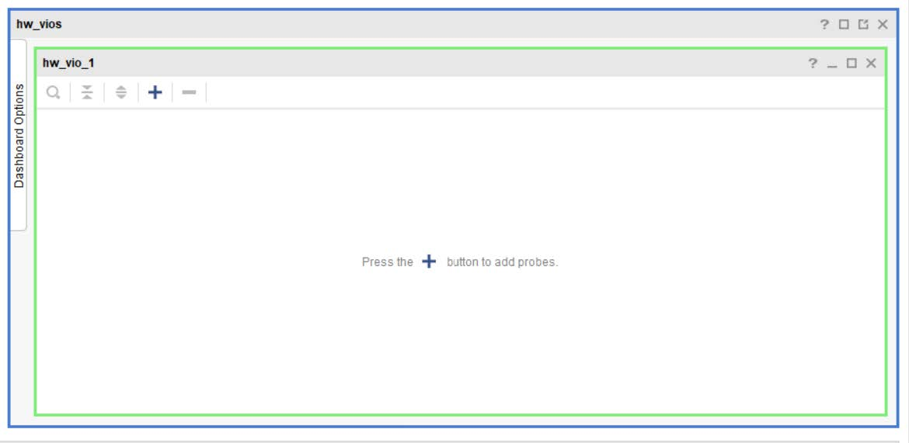

Copyright (C)  2019-2020  NICOLAS RUIZ REQUEJO.
Permission is granted to copy, distribute and/or modify this document
under the terms of the GNU Free Documentation License, Version 1.3
or any later version published by the Free Software Foundation;
with the Invariant Sections being "Inicialización de RAM en VHDL93",
"Depuración del hardware"; no Front-Cover Texts, and no Back-Cover Texts.
A copy of the license is included in the section entitled "GNU
Free Documentation License".

# Inicialización de memorias desde ficheros de texto en FPGA - Tutorial para VHDL93 en Vivado y depuración de su contenido

- [Inicialización de memorias desde ficheros de texto en FPGA - Tutorial para VHDL93 en Vivado y depuración de su contenido](#inicialización-de-memorias-desde-ficheros-de-texto-en-fpga---tutorial-para-vhdl93-en-vivado-y-depuración-de-su-contenido)
- [Objetivos](#objetivos)
- [Sobre la biblioteca VHDL para la gestión de ficheros](#sobre-la-biblioteca-vhdl-para-la-gestión-de-ficheros)
- [Inicialización de RAM en VHDL93](#inicialización-de-ram-en-vhdl93)
  - [Código para leer el fichero](#código-para-leer-el-fichero)
  - [Simulación](#simulación)
  - [Validación del diseño con Nexys4-DDR](#validación-del-diseño-con-nexys4-ddr)
- [Depuración del hardware](#depuración-del-hardware)
  - [Herramientas](#herramientas)
  - [Core VIO](#core-vio)
  - [Comprobando la RAM con VIO](#comprobando-la-ram-con-vio)
- [Referencias](#referencias)

# Objetivos

El presente tutorial tiene los siguientes objetivos:

-   Formas de inicializar el contenido de memorias RAM implementadas en
    FPGA a partir de ficheros de texto. De modo que cada línea de texto
    representa el dato a almacenar en cada dirección de memoria, binario
    o hexadecimal.

-   Uso de un "IP core" de depuración, VIO, para examinar el contenido
    de la memoria RAM implementada en tiempo de ejecución.

# Sobre la biblioteca VHDL para la gestión de ficheros 

Los mecanismos presentes incluyen:

-   Definiciones de tipos de fichero

-   Declaración de objetos fichero.

-   Procedimientos para lectura y escritura en ficheros. Estos ficheros
    solo pueden incluir datos escalares o compuestos de una sola
    dimensión.

Los constructores mencionados escriben y leen datos en formato binario
dependiendo de la herramienta utilizada. Por ejemplo, Vivado&reg; de Xilinx
puede escribir y leer enteros de un fichero con VHDL en un formato
distinto del que usa Quartus&reg; de Intel. Por ello para lograr la
interoperabilidad entre diferentes herramientas se usarán solo ficheros
de texto plano. E incluirán solo los tipos y operaciones que
proporcionan los paquetes "textio", de la biblioteca "std" y
"std\_logic\_textio" de la biblioteca "IEEE".

En general, las operaciones de lectura/escritura de ficheros en VHDL no
son sintetizables, pero sí permitidas en simulación, si bien algunas
herramientas permiten la lectura de ficheros para síntesis. A lo largo
de este tutorial se muestran las formas de realizarlo en Vivado&reg; con
proyectos en VHDL93 y VHDL2008.

# Inicialización de RAM en VHDL93 

Comenzamos creando un nuevo proyecto en Vivado&reg; *File \> Project \> New
\> next*

Lo llamaremos "RAM\_TEST\_93", hacemos click en el botón "Next" y
dejamos la opción "RTL project" establecida por defecto. A continuación,
creamos un nuevo fichero fuente VHDL de nombre "RAM\_WF\_93". Luego,
seleccionamos el modelo de FPGA, para este tutorial se ha usado la
Artix-7 xc7a100tcsg324-1; finalizamos.

Nos pedirá introducir las definiciones de puertos, lo ignoramos.

 
##### Figura 1 <!-- omit in toc -->


Cuando creamos un fichero VHDL, por defecto Vivado&reg; lo crea para
sintetizarlo según el estándar VHDL93. Podemos comprobarlos mirando las
propiedades del fichero, ver figura 2.


##### Figura 2. Versión de VHDL <!-- omit in toc -->

Para este tutorial, utilizaremos la descripción de una memoria RAM de
tipo *write-first*. Copie el siguiente código:

```VHDL
library IEEE;
use IEEE.STD_LOGIC_1164.ALL;
use IEEE.NUMERIC_STD.ALL;

entity RAM_WF_93 is
    generic (
           address_width : integer := 4; 
           data_width : integer := 8);
    Port ( DataIn : in  std_logic_vector(data_width-1 downto 0);
           WE : in  std_logic;
           Address : in  std_logic_vector(address_width-1 downto 0);
           DataOut : out  std_logic_vector(data_width-1 downto 0);
           CLK : in  std_logic);
end RAM_WF_93;

architecture Behavioral of RAM_WF_93 is
    type ram_type is array(0 to (2**address_width)-1) 
            of std_logic_vector(data_width-1 downto 0);             
    
    signal RAM : ram_type;
begin

    process(Clk)
    begin
        if rising_edge(Clk) then
            if WE = '1' then
                RAM(to_integer(unsigned(Address))) <= DataIn;
                DataOut <= DataIn;
            else
                DataOut <= RAM(to_integer(unsigned(Address)));
            end if;
        end if;
    end process;
end Behavioral;
```
##### Figura 3. Código VHDL RAM write-first genérica <!-- omit in toc -->

El fichero de texto que vamos a usar para inicializar la RAM, tendrá
tantas líneas de texto como direcciones tenga la RAM inferida y cada
línea incluirá:

-   Una cadena de ceros y unos, tantos como bits tenga cada palabra de
    la RAM.

-   O una cadena en hexadecimal que coincida con el ancho de palabra de
    la RAM.

El fichero o está en binario o en hexadecimal, pero no podemos mezclar
ambos. Para nuestro ejemplo usaremos el siguiente contenido hexadecimal,
considerando una RAM de 16x8:


##### Figura 4. Datos para inicializar la RAM <!-- omit in toc -->

## Código para leer el fichero

Para usar los tipos y operaciones para trabajar con ficheros de texto,
incluimos los paquetes:

```VHDL
\-- Provides the types \"string\", \"text\" and \"line\"
use STD.TEXTIO.ALL;
\-- Allows \"std\_logic\" can be used as a type in the text file
use IEEE.STD\_LOGIC\_TEXTIO.ALL;
```

Vamos a añadir, en la cláusula **generic** de la entidad, un parámetro
de tipo *string* que sirva para pasar la ruta donde se encuentra el
fichero que queremos usar para inicializar la RAM:

```VHDL
entity RAM_WF_93 is
    generic ( datafile : string := "D:\mem.dat";
…
```

La forma de conseguir leer del fichero, es incluir una función en el
cuerpo de la arquitectura que reciba como parámetro la ruta del fichero
y devuelva una variable, del tipo *ram\_type* declarado en la
arquitectura. Esta función será llamada para inicializar la señal que
almacenará el contenido de la RAM.

El código de la función es:

```VHDL
------------------------------------------------------------------------
    -- "Impure" function means different types can be returned.
    -- "file_name" is a parameter to call the function "load_ram_from_file".
    -- The function returns the type "ram_type" defined in this code
-------------------------------------------------------------------------    
impure function load_ram_from_file(file_name : in string) return ram_type is
    -- "fdata" is the object type "file"
        file     fdata  : text open read_mode is file_name;
    -- "mline" is a variable to read the file, line to line
        variable mline  : line;
    -- "temp_mem" variable to store, within the function, each line is read
        variable temp_mem: ram_type;

    begin
    -- Body of the function is a loop to read the whole text file
        for i in ram_type'range loop 
            -- "readline" is a function from "TEXTIO" package. Read a line
            -- in file text in each iteration
            readline(fdata, mline);
            -- To read binary format i.e: 4 bit length -> 0011 
            -- read(mline, temp_mem(i));

            
            -- To read hex format i.e: 8 bit lenght -> 2f 
            -- Store the text in the variable to return
  
            hread(mline, temp_mem(i));
         end loop;
                
  return temp_mem;
 end function;
```
##### Figura 5. Función para leer datos en el fichero de texto <!-- omit in toc -->

Necesitamos declarar la función como ***impure*** porque lo que devuelve
la función puede ser diferente para un mismo parámetro de entrada,
dependiendo del contenido del fichero en cada instante.

En la función se declara:

-   Un objeto ***file*** para acceder al fichero en modo solo lectura
    (***read\_mode***); el tipo del fichero para texto es ***text y***
    lo proporciona el paquete ***textio***.

-   Una variable de tipo ***line***, tipo proporcionado por el paquete
    ***textio*** que representa una línea completa de texto de un
    fichero.

-   Una variable de tipo ***ram\_type*** que es el tipo que hemos
    definido para representar el contenido de la RAM (vector de
    std\_logic\_vector).

Luego en un bucle que itera el número de líneas que tiene el fichero
(número de direcciones de la RAM):

-   se toma una línea de texto del fichero con la función
    ***readLine***.

-   Para extraer de la línea el valor en el tipo deseado que en nuestro
    caso es ***std\_logic\_vector*** usamos la función ***read(inout**
    line, **out** buffer**)*** si el formato es binario ó
    ***hread(inout** line, **out** buffer**)*** si está en hexadecimal.
    Ambas funciones se encuentran en el paquete
    ***ieee.std\_logic\_textio.***

-   En la posición i-ésima de la variable de tipo *ram\_type* se
    almacena el valor convertido a ***std\_logic\_vector*** de la línea
    i-ésima.

-   La función devuelve la variable de tipo *ram\_type* con el contenido
    para inicializar la memoria.

En el siguiente listado se muestra el código completo del ejemplo:

```VHDL
library IEEE;
use IEEE.STD_LOGIC_1164.ALL;
-- Provides the types "string", "text" and "line"
use STD.TEXTIO.ALL;
-- Allows "std_logic" can be used as a type in the text file
-- It is a not standard package and is deprecated.
use IEEE.STD_LOGIC_TEXTIO.ALL;
use IEEE.NUMERIC_STD.ALL;

entity RAM_WF_93 is
    generic (datafile : string := "F:\VIVADO_PROJECTS_PRUEBAS\MEMO_INIT\data_init.dat";
              address_width : integer := 4; 
              data_width : integer := 8);
    Port ( DataIn   : in  std_logic_vector(data_width-1 downto 0);
           WE       : in  std_logic;
           Address  : in  std_logic_vector(address_width-1 downto 0);
           DataOut  : out  std_logic_vector(data_width-1 downto 0);
           CLK      : in  std_logic);
end RAM_WF_93;

architecture Behavioral of RAM_WF_93 is
    type ram_type is array(0 to (2**address_width)-1) 
            of std_logic_vector(data_width-1 downto 0);
    ------------------------------------------------------------------------
    --                 FUNCTION to read a text file
    ------------------------------------------------------------------------
    -- "Impure" function means different types can be returned.
    -- "file_name" is a parameter to call the function "load_ram_from_file".
    -- The function returns the type "ram_type" defined in this code
    -------------------------------------------------------------------------    
    impure function load_ram_from_file(file_name : in string) return ram_type is
    -- "fdata" is the object type "file"
        file     fdata  : text open read_mode is file_name;
    -- "mline" is a variable to read the file, line to line
        variable mline  : line;
    -- "temp_mem" is a variable to read values in a line
        variable temp_mem: ram_type;
    begin
    -- Body of the function is a loop to read the whole text file
        for i in ram_type'range loop 
            -- (1) READ A LINE from a file text
            -- "readline" is a procedure from "TEXTIO" package. 
            readline(fdata, mline);
            
            -- (2) READ VALUES iN A LINE 
         -- "Read" is  a procedure from "TEXTIO" package. 
            -- Thanks to the non-standard package IEEE.STD_LOGIC_TEXTIO (deprecated)
            -- the data read can be as std_logic type
            
                    -- OPTION 2.1: Binary format
                    -- read(mline, temp_mem(i)); 
                    
                    -- OPTION 2.2: Hexadecimal format       
                    hread(mline, temp_mem(i));
        end loop;
               
      return temp_mem;    
    end function;               
    
    signal RAM : ram_type := load_ram_from_file(datafile);
    
begin

    process(Clk)
    begin
        if rising_edge(Clk) then
            if WE = '1' then
                RAM(to_integer(unsigned(Address))) <= DataIn;
                DataOut <= DataIn;
            else
                DataOut <= RAM(to_integer(unsigned(Address)));
            end if;
        end if;
    end process;
      
end Behavioral;
```

##### Figura 6. Código completo de VHDL93 <!-- omit in toc -->

En la línea destacada, es donde se declara la señal de la memoria RAM y
se inicializa llamando a la función "load\_ram\_from\_file".

## Simulación

Vamos a simular nuestro diseño, para ello añadimos un nuevo fichero
fuente para simulación:


##### Figura 7. Crear nueva fuente para simulación. <!-- omit in toc -->

Le llamaremos "RAM\_WF\_93\_tb":


##### Figura 8. Crear nueva fuente para simulación <!-- omit in toc -->

En la ventana con el asistente, dejamos las definiciones de puertos
vacías y hacemos click en el botón **"yes"** del cuadro de diálogo:


##### Figura 9. definición de puertos vacía. <!-- omit in toc -->

Sustituimos el contenido por defecto con el siguiente testbench:

```VHDL
library IEEE;
use IEEE.Std_logic_1164.all;
use IEEE.Numeric_Std.all;

entity RAM_WF_93_tb is
end;

architecture bench of RAM_WF_93_tb is

  component RAM_WF_93
      generic ( datafile : string;
                address_width : integer := 4; 
                data_width : integer := 8);
      Port ( DataIn : in  std_logic_vector(data_width-1 downto 0);
             WE : in  std_logic;
             Address : in  std_logic_vector(address_width-1 downto 0);
             DataOut : out  std_logic_vector(data_width-1 downto 0);
             CLK : in  std_logic);
  end component;
  
  constant dataw : integer := 8;
  constant addrw : integer := 4;   
  
  signal DataIn: std_logic_vector(dataw-1 downto 0);
  signal WE: std_logic;
  signal Address: std_logic_vector(addrw-1 downto 0);
  signal DataOut: std_logic_vector(dataw-1 downto 0);
  signal CLK: std_logic;

  constant clock_period: time := 10 ns;
  signal stop_the_clock: boolean;

begin

  -- Insert values for generic parameters !!
  uut: RAM_WF_93 generic map ( datafile      => "D:\mem.dat",   -- path to mem data file on host system
                            address_width => 4,
                            data_width    => 8 )
                 port map ( DataIn        => DataIn,
                            WE            => WE,
                            Address       => Address,
                            DataOut       => DataOut,
                            CLK           => CLK );

  stimulus: process
  begin
  
    -- Put initialisation code here
        WE <= '0';
        Address <= "0000";
        wait for 40 ns;
        Address <= "0001";
        wait for 40 ns;
        Address <= "0010";
        wait for 40 ns;    
        Address <= "0011";
        wait for 40 ns;
        Address <= "0100";
        wait for 40 ns;
        Address <= "0101";
        wait for 40 ns;
        Address <= "0110";
        wait for 40 ns;
        Address <= "0111";
        wait for 40 ns;
        Address <= "1000";
        wait for 40 ns;
        Address <= "1001";
        wait for 40 ns;
        Address <= "1010";
        wait for 40 ns;    
        Address <= "1011";
        wait for 40 ns;
        Address <= "1100";
        wait for 40 ns;
        Address <= "1101";
        wait for 40 ns;
        Address <= "1110";
        wait for 40 ns;
        Address <= "1111";

    -- Put test bench stimulus code here

    stop_the_clock <= true;
    wait;
  end process;

  clocking: process
  begin
    while not stop_the_clock loop
      Clk <= '0', '1' after clock_period / 2;
      wait for clock_period;
    end loop;
    wait;
  end process;

end;
```
##### Figura 10. Código testbench para ram <!-- omit in toc -->

En el parámetro ***datafile*** del ***generic map*** debes poner la ruta
donde se encuentra el fichero con el que quieres inicializar la memoria,
en nuestro caso es "D:\\mem.dat". Y ejecutamos la simulación:


##### Figura 11. Ejecutar simulación <!-- omit in toc -->

Podremos observar en la señal "DataOut" los datos almacenados en cada
dirección de la memoria RAM, que son los mismos que se escribieron en el
fichero de texto:


##### Figura 12. Resultado simulación. <!-- omit in toc -->

## Validación del diseño con Nexys4-DDR

Para probar el diseño en la FPGA tenemos que añadir un fichero de
restricciones. Podemos usar el siguiente y dejaremos los parámetros
***generic*** de la entidad *RAM\_WF\_93* con sus valores por defecto,
recordando proporcionar un camino válido para el parámetro
***datafile***.


##### Figura 13. Parámetros **generic** por defecto. <!-- omit in toc -->

```Tcl
## Clock signal
set_property -dict { PACKAGE_PIN E3    IOSTANDARD LVCMOS33 } [get_ports { CLK }];
create_clock -add -name sys_clk_pin -period 10.00 -waveform {0 5} [get_ports {CLK}];


##Switches

set_property -dict { PACKAGE_PIN J15   IOSTANDARD LVCMOS33 } [get_ports { DataIn[0] }]; #IO_L24N_T3_RS0_15 Sch=sw[0]
set_property -dict { PACKAGE_PIN L16   IOSTANDARD LVCMOS33 } [get_ports { DataIn[1] }]; #IO_L3N_T0_DQS_EMCCLK_14 Sch=sw[1]
set_property -dict { PACKAGE_PIN M13   IOSTANDARD LVCMOS33 } [get_ports { DataIn[2] }]; #IO_L6N_T0_D08_VREF_14 Sch=sw[2]
set_property -dict { PACKAGE_PIN R15   IOSTANDARD LVCMOS33 } [get_ports { DataIn[3] }]; #IO_L13N_T2_MRCC_14 Sch=sw[3]
set_property -dict { PACKAGE_PIN R17   IOSTANDARD LVCMOS33 } [get_ports { DataIn[4] }]; #IO_L12N_T1_MRCC_14 Sch=sw[4]
set_property -dict { PACKAGE_PIN T18   IOSTANDARD LVCMOS33 } [get_ports { DataIn[5] }]; #IO_L7N_T1_D10_14 Sch=sw[5]
set_property -dict { PACKAGE_PIN U18   IOSTANDARD LVCMOS33 } [get_ports { DataIn[6] }]; #IO_L17N_T2_A13_D29_14 Sch=sw[6]
set_property -dict { PACKAGE_PIN R13   IOSTANDARD LVCMOS33 } [get_ports { DataIn[7] }]; #IO_L5N_T0_D07_14 Sch=sw[7]
set_property -dict { PACKAGE_PIN U8    IOSTANDARD LVCMOS18 } [get_ports { WE }]; #IO_25_34 Sch=sw[9]
set_property -dict { PACKAGE_PIN H6    IOSTANDARD LVCMOS33 } [get_ports { Address[0] }]; 
#IO_L24P_T3_35 Sch=sw[12]
set_property -dict { PACKAGE_PIN U12   IOSTANDARD LVCMOS33 } [get_ports { Address[1] }]; #IO_L20P_T3_A08_D24_14 Sch=sw[13]
set_property -dict { PACKAGE_PIN U11   IOSTANDARD LVCMOS33 } [get_ports { Address[2] }]; #IO_L19N_T3_A09_D25_VREF_14 Sch=sw[14]
set_property -dict { PACKAGE_PIN V10   IOSTANDARD LVCMOS33 } [get_ports { Address[3] }]; #IO_L21P_T3_DQS_14 Sch=sw[15]


## LEDs

set_property -dict { PACKAGE_PIN H17   IOSTANDARD LVCMOS33 } [get_ports { DataOut[0] }]; #IO_L18P_T2_A24_15 Sch=led[0]
set_property -dict { PACKAGE_PIN K15   IOSTANDARD LVCMOS33 } [get_ports { DataOut[1] }]; #IO_L24P_T3_RS1_15 Sch=led[1]
set_property -dict { PACKAGE_PIN J13   IOSTANDARD LVCMOS33 } [get_ports { DataOut[2] }]; #IO_L17N_T2_A25_15 Sch=led[2]
set_property -dict { PACKAGE_PIN N14   IOSTANDARD LVCMOS33 } [get_ports { DataOut[3] }]; #IO_L8P_T1_D11_14 Sch=led[3]
set_property -dict { PACKAGE_PIN R18   IOSTANDARD LVCMOS33 } [get_ports { DataOut[4] }]; #IO_L7P_T1_D09_14 Sch=led[4]
set_property -dict { PACKAGE_PIN V17   IOSTANDARD LVCMOS33 } [get_ports { DataOut[5] }]; #IO_L18N_T2_A11_D27_14 Sch=led[5]
set_property -dict { PACKAGE_PIN U17   IOSTANDARD LVCMOS33 } [get_ports { DataOut[6] }]; #IO_L17P_T2_A14_D30_14 Sch=led[6]
set_property -dict { PACKAGE_PIN U16   IOSTANDARD LVCMOS33 } [get_ports { DataOut[7] }]; #IO_L18P_T2_A12_D28_14 Sch=led[7]
```
##### Figura 14. Fichero de restricciones para RAM\_TEST\_93 (RAM\_TEST\_93.xdc) <!-- omit in toc -->

Una vez añadido el fichero de restricciones, ejecutamos la síntesis y la
implementación y comprobamos que no haya errores:


##### Figura 15. Síntesis e implementación. <!-- omit in toc -->

Luego, generamos el fichero bitstream en *Flow navigator \>Program and
debug \>Generate Bitstream,* cuando finalice abrimos la herramienta
*Hardware manager*. Conectamos la placa al PC y seguimos los siguientes
pasos:


##### Figura 16. Programación de la FPGA incluida en la placa Nexys4-DDR <!-- omit in toc -->

Cuando finalice la programación podremos comprobar el correcto
funcionamiento del circuito en la FPGA. Para ello iremos seleccionando
diferentes direcciones con los switches y observaremos su contenido
mediante los LED.


##### Figura 17. Contenido dirección 00h <!-- omit in toc -->


##### Figura 18. Contenido dirección 01h <!-- omit in toc -->

# Depuración del hardware 

Vamos a introducir una serie de herramientas que permiten al usuario
depurar sus diseños mientras se están ejecutando en el hardware. En
nuestro caso mostraremos como utilizarlas para comprobar el contenido
que se ha cargado en la memoria RAM implementada en la FPGA.

## Herramientas

Para realizar tareas de depuración Vivado&reg; proporciona varios tipos de
"IP *cores"* que podemos añadir y conectar a nuestros diseños, algunos
antes de la síntesis y otros post síntesis, cada uno para diferentes
objetivos. Estos "IP cores" se manejan desde el *Hardware Manager* de
Vivado&reg; que ofrece una interfaz para interactuar con ellos.

## Core VIO

El "IP core" denominado VIO (Virtual Input Output) es el que vamos a
mostrar en este tutorial. Nos permite, no solo monitorizar los valores
lógicos de señales en nuestro diseño, si no también manejarlas mediante
software. Así, podremos comprobar cómo cambian ciertas señales al
aplicar diferentes estímulos en otras. Al usar VIO tendremos presente
que:

-   La señal de reloj que utilicemos tiene que ser la misma que usa el
    diseño que vamos a monitorizar.

-   Hay dos tipos de señales que actúan como sondas:

    -   *Input probes:* una entrada hacía un core VIO, aquí conectamos
        las señales del diseño que queramos monitorizar.

    -   *Output probes:* una salida desde un core VIO, aquí conectamos
        las señales de nuestro diseño que queremos manipular, estos
        aplican diferentes valores como estímulo.

## Comprobando la RAM con VIO 

Abrimos el proyecto del apartado anterior, en el *Flow Navigator*
abrimos *IP catalog*.


##### Figura 19. Abrir IP catalog <!-- omit in toc -->

De entre las distintas categorías seleccionamos *Debug & Verification \>
Debug*

Elegimos el elemento *VIO (Virtual Input/Output)* y pulsamos el botón de
la llave inglesa *Customize IP:*


##### Figura 20. Seleccionar IP <!-- omit in toc -->

Aparecerá una ventana para configurar los parámetros del componente como
en la *Figura 21. Configurar IP VIO*. En la pestaña de opciones
generales encontramos:

-   *Component Name:* le podemos cambiar el nombre al VIO o dejar la
    opción por defecto.

-   *Input probe count y Output probe count:* indicamos cuantas sondas
    de cada tipo queremos añadir.

En la pestaña *PROBE\_IN PORTS* indicamos el ancho, en bits, de cada
sonda de entrada.

En la pestaña *PROBE\_OUT PORTS* se establece también el ancho en bits
de cada sonda. Además, hay que escribir un valor por defecto en formato
hexadecimal.

Para el ejemplo que nos ocupa, vamos a utilizar una sonda de entrada de
8 bits de ancho para la señal de salida de datos, "DataOut". Y una sonda
de salida de 4 bits de ancho para la entrada de direcciones de la RAM,
"Address".


##### Figura 21. Configurar IP VIO <!-- omit in toc -->


##### Figura 22. Sonda de entrada. <!-- omit in toc -->


##### Figura 23. Sonda de salida. <!-- omit in toc -->

Aceptamos y avanzamos en las siguientes ventanas, y cuando se abra
G*enerate Outputs Products* dejamos marcada la opción *Out of context
per IP* y pulsamos Generate. Tendremos que esperar hasta que aparezca el
mensaje de la *Figura 25. IP generada.*


##### Figura 24. Generate Outputs products. <!-- omit in toc -->


##### Figura 25. IP generada. <!-- omit in toc -->

Ahora en *Sources \> IP Sources* aparecerá el IP core generado. En la
ventana ***Sources***, pestaña ***IP Source***, si desplegamos el módulo
"vio\_0", podemos abrir la plantilla de instanciación del componente,
con extensión vho.


##### Figura 26. Plantilla instanciación. <!-- omit in toc -->

Para unir el IP core VIO a nuestra RAM, vamos a crear un nuevo fichero
con el nombre *RAM\_WF\_TOP*. En el asistente, incluimos definiciones de
puertos similares a las de la entidad *RAM\_WF.*

Ahora siguiendo los pasos de una descripción estructural en VHDL,
abrimos la plantilla de instanciación "*vio\_0.vho"* y copiamos la
declaración de componente en la parte declarativa de la arquitectura de
*RAM\_WF\_TOP. Luego copiamos* la plantilla de instanciación en el
cuerpo de arquitectura de *RAM\_WF\_TOP.*

Ahora tenemos que instanciar un componente de *RAM\_WF* en
*RAM\_WF\_TOP* y declarar las señales para unir ambos componentes. El
código completo se muestra en la Figura 27. RAM\_WF\_TOP.vhd.

```VHDL
entity RAM_WF_TOP is
    Port ( DataIn : in  word;
           WE : in  STD_LOGIC;
           Address : in  STD_LOGIC_VECTOR(address_width-1 downto 0);
           DataOut : out  word;
           CLK : in  STD_LOGIC);
end RAM_WF_TOP;

architecture Behavioral of RAM_WF_TOP is

    COMPONENT vio_0
      PORT (
        clk : IN STD_LOGIC;
        probe_in0 : IN STD_LOGIC_VECTOR(7 DOWNTO 0);
        probe_out0 : OUT STD_LOGIC_VECTOR(3 DOWNTO 0)
      );
    END COMPONENT;
    
    component RAM_WF is
        generic ( datafile : string := "D:\mem.dat");
        Port ( DataIn : in  word;
               WE : in  STD_LOGIC;
               Address : in  STD_LOGIC_VECTOR (address_width-1 downto 0);
               DataOut : out  word;
               CLK : in  STD_LOGIC);
    end component;
    
    signal dbg_out_Address : std_logic_vector(address_width-1 downto 0);
    signal dbg_in_DataOut : std_logic_vector(data_width-1 downto 0);
begin

    debug_core : vio_0
      PORT MAP (
        clk => CLK,
        probe_in0 => dbg_in_DataOut,
        probe_out0 => dbg_out_Address
      );

    my_ram : RAM_WF
      port map (
        DataIn => DataIn,
        WE => WE,
        Address => dbg_out_Address,
        DataOut => dbg_in_DataOut,
        CLK => CLK
      );

end Behavioral;
```
##### Figura 27. RAM\_WF\_TOP.vhd <!-- omit in toc -->

A continuación, realizamos la síntesis, implementación y generación del
bitstream. Una vez obtenido el fichero de configuración, *bitstream*,
abrimos la herramienta *Hardware Manager* y conectamos con la placa
Nexys4 usando el botón de *Auto Connect*. Si se ha detectado
correctamente, procedemos a programar la FPGA pulsando en *Program
Device. A*utomáticamente detecta el fichero *bitstream* y un fichero
*debug probe* que tiene extensión *.ltx*, pulsamos *Program.*


##### Figura 28. Program bitstream. <!-- omit in toc -->

Automáticamente se abrirá en el *Hardware Manager* la vista del *Serial
I/O Analyzer* que podemos observar en la *Figura 29. Serial I/O
Analyzer.*


##### Figura 29. Serial I/O Analyzer. <!-- omit in toc -->

Pulsando sobre el botón + se desplegará un menú para seleccionar las
sondas que se quiera mostrar. Seleccionamos las dos señales que se
muestran y pulsamos OK como en la *Figura 30. Añadir debug probes.*


##### Figura 30. Añadir debug probes. <!-- omit in toc -->

Aparecerán las señales en el área "Dashboard", podemos reordenarlas
arrastrando con el ratón. El campo más interesante es ***value,*** en él
se muestra el valor de las señales en cada instante y también permite
introducir diferentes estímulos en aquellas señales que sean de tipo
salida. En nuestro ejemplo, la señal *dbg\_out\_Address* tiene dirección
output, es la que pusimos como sonda para la entrada de dirección de la
RAM, así que podemos cambiar su valor e ir viendo el contenido de la RAM
en *dbg\_in\_DataOut.*

*Las siguientes imágenes muestran diferentes estímulos y la respuesta
conseguida en cada caso.*


##### Figura 31. Contenido de la dirección 0h. <!-- omit in toc -->


##### Figura 32. Contenido de la dirección 3h <!-- omit in toc -->

# Referencias

- Ashenden, P. J. (2008). *The Designer\'s Guide to VHDL.* Elsevier Science & Technology.
- IEEE. (26 de Septiembre de 2008). IEEE Std 1076-2008. IEEE Standard VHDL Language.
- Xilinx. (4 de April de 2018). PG159 Virtual Input/Output v3.0 LogiCORE IP Product Guide.
- Xilinx. (18 de January de 2019). UG908 Vivado Programming and Debugging.
- Xilinx. (s.f.). *AR\# 38115 Why are there some signals in red and gray in the signal list?* Obtenido de https://www.xilinx.com/support/answers/38115.html
- Xilinx. (s.f.). *Debug Cores Training*. Obtenido de https://www.xilinx.com/training/customer-training/debug-cores-video.html
- Xilinx. (s.f.). *Logic Debug in Vivado*. Obtenido de https://www.xilinx.com/video/hardware/logic-debug-in-vivado.html
- Xilinx. (s.f.). *Mark signals to debug in a netlist not shown*. Obtenido de https://forums.xilinx.com/t5/Synthesis/Mark-signals-to-debug-in-a-netlist-not-shown/m-p/984054
- Xilinx. (s.f.). *Using New Dashboards in Vivado Logic Analyzer*. Obtenido de https://www.xilinx.com/video/hardware/dashboards-in-vivado-logic-analyzer.html
- Xilinx. (s.f.). *Vivado Hardware Debug*. Obtenido de https://www.xilinx.com/products/design-tools/vivado/debug.html\#hardware
